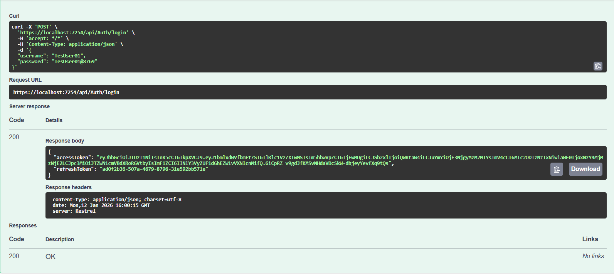
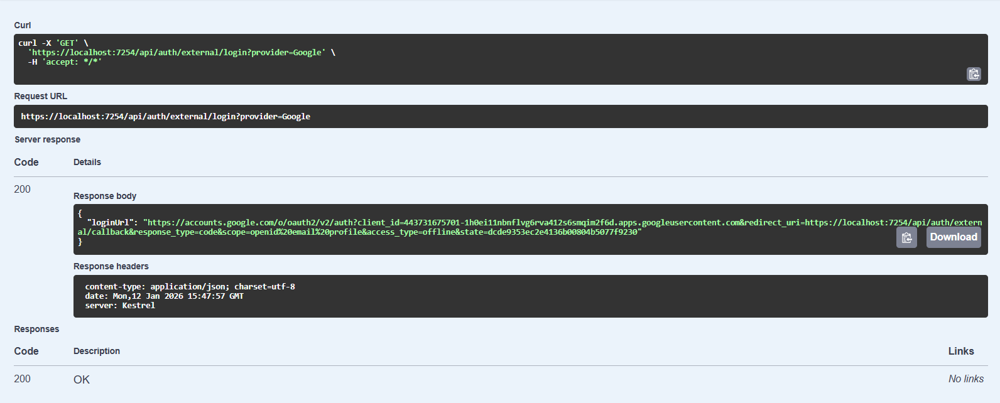
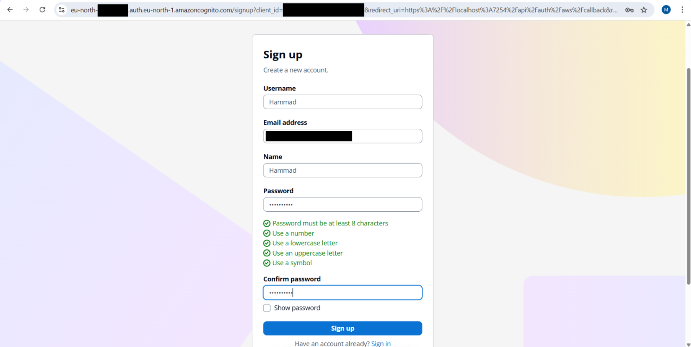
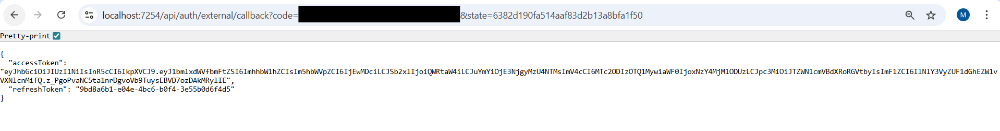
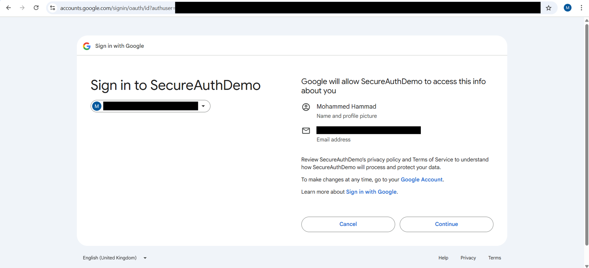
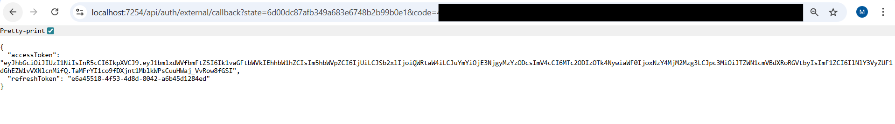
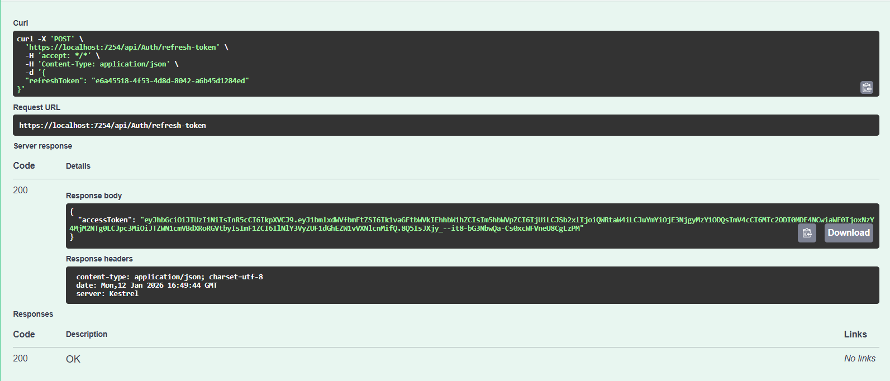

# SecureAuthDemo

SecureAuthDemo is a portfolio ASP.NET Core Web API demonstrating common authentication patterns: local JWT auth with refresh tokens, external SSO via Google and AWS Cognito (authorization code flow), and pluggable caching (Memory/Redis) used for refresh tokens and state.

## Key Features
- Local username/password registration and login (BCrypt + JWT + refresh token)
- External login via Google and AWS Cognito (authorization code flow)
- Refresh token storage (in-memory or Redis) with TTL
- Role-based authorization example (`AdminOnly` policy)
- Interactive Swagger UI with a dynamic Google login button
- Serilog request logging and custom middleware for errors and request/response logging
- EF Core `AppDbContext` for user persistence

## Architecture & Components
- Controllers: `AuthController`, `ExternalAuthController`, `SampleController`
- Auth services:
  - Local: `LocalAuthService` (`IAuthService`)
  - External: `GoogleAuthService`, `CognitoAuthService` (`IExternalAuthService`)
  - Orchestration: `ExternalAuthFlow`, `ExternalAuthServiceResolver`
- Cache: `MemoryCacheService`, `RedisService` (`ICacheService`)
- State store: `StateStore` (uses cache for external auth `state` values)
- Config classes: `JwtSettings`, `GoogleAuthSettings`, `AwsCognitoSettings`
- DI + middleware wiring in `DependencyInjectionExtensions`, `AuthenticationExtensions`, `CacheExtensions`, `SwaggerExtensions`

## Authentication Flows
- Local
  - `POST /api/auth/register` — register a user (stores hashed password)
  - `POST /api/auth/login` — returns `{ accessToken, refreshToken }`
  - `POST /api/auth/refresh-token` — exchange refresh token for a new access token
- External (SSO)
  - `GET /api/auth/external/login?provider={Google|Cognito}` — returns provider login URL (saves state)
  - `GET /api/auth/external/callback?code=...&state=...` — exchanges code, validates identity, then issues JWT + refresh token

## Notable Endpoints
- `GET /health` — health check
- `POST /api/auth/register`
- `POST /api/auth/login`
- `POST /api/auth/refresh-token`
- `GET /api/auth/external/login?provider=Google`
- `GET /api/auth/external/callback`
- `GET /api/sample/public`
- `GET /api/sample/protected` (requires `Authorization: Bearer <JWT>`)
- `GET /api/sample/admin-data` (requires claim `Role=Admin`)

## Configuration
- `JwtSettings` (Key, Issuer, Audience, ExpiryMinutes)
- `GoogleAuthSettings` (ClientId, ClientSecret, RedirectUri, TokenUri)
- `AwsCognitoSettings` (Domain, ClientId, ClientSecret, RedirectUri)
- `ConnectionStrings:DefaultConnection` — SQL Server connection
- `CacheSettings:UseRedis` — enable Redis selection

Store secrets in environment variables or user secrets — do not commit them.

## Quickstart
1. Restore and build:
```powershell
dotnet restore
dotnet build
```
2. Configure `appsettings.Development.json` or environment variables for `JwtSettings`, provider settings and `DefaultConnection`.
3. Apply EF migrations (if needed):
```powershell
dotnet ef database update
```
4. Run the app:
```powershell
dotnet run
```
Open the URL shown in the console (Swagger UI is served at the app root in Development).

## Notes & Caveats
- Refresh tokens are generated as GUIDs and stored in cache (7-day TTL by default).
- `LocalAuthService` sets an `Admin` claim for demo purposes — change this for production.
- External providers require matching `RedirectUri` values configured in their consoles.
- Redis is optional; the app falls back to memory cache if Redis is unavailable.

## Files of interest
- [Program.cs](Program.cs)
- [Controllers/AuthController.cs](Controllers/AuthController.cs)
- [Controllers/ExternalAuthController.cs](Controllers/ExternalAuthController.cs)
- [Services/Auth/Local/LocalAuthService.cs](Services/Auth/Local/LocalAuthService.cs)
- [Services/Auth/External/GoogleAuthService.cs](Services/Auth/External/GoogleAuthService.cs)
- [Services/Auth/External/CognitoAuthService.cs](Services/Auth/External/CognitoAuthService.cs)

## Screenshots


Normal local login request and successful response (JWT + refresh token).


Swagger call showing the external login URL returned by `GET /api/auth/external/login`.


AWS Cognito hosted UI sign-up / sign-in page.


Callback API response showing issued `AccessToken` and `RefreshToken`.


Google OAuth consent screen.


Callback API response for Google showing `AccessToken` and `RefreshToken`.


Refresh token flow: `POST /api/auth/refresh-token` showing the request using the stored refresh token and the new access token returned.

## Next steps / Improvements

Short-term (implement within repo)
- Persist roles and claims in the database; expose minimal admin UI or seedable role assignments.
- Harden refresh-token lifecycle: implement rotation, single-use tokens, revocation list, and secure persistent storage for long-term tokens.
- Add audit logging of authentication events (login, logout, token refresh) including IP, timestamp, and user-agent to support future blocking or investigation.
- Improve exception handling and structured logging: add correlation IDs, enrich Serilog events, and centralize error mapping in `ExceptionHandlingMiddleware`.
- Add integration and E2E tests for local auth and external SSO flows.

Medium-term (ops & security)
- Containerize the app with a `Dockerfile` and add a CI pipeline (GitHub Actions / Azure DevOps) to run tests and build artifacts.
- Add secrets management for provider credentials (Azure Key Vault / GitHub Secrets) and rotate secrets periodically.
- Add monitoring and alerting (Application Insights or Prometheus + Grafana) for auth failures, high error rates, and suspicious activity.
- Introduce rate limiting and IP reputation checks to mitigate abuse.

Long-term (product & UX)
- Build a lightweight web UI (React, Blazor, or Next.js) for user sign-up, login, profile management, and an admin panel to manage roles and view audit logs.
- Implement user/device management features (revoke sessions, view active refresh tokens, block IPs/users).
- Expand external providers and add account linking/unlinking flows.

## License
This project is licensed under the MIT License — see the [LICENSE](LICENSE) file for details.

Copyright (c) 2025 Mohammed Hammad.